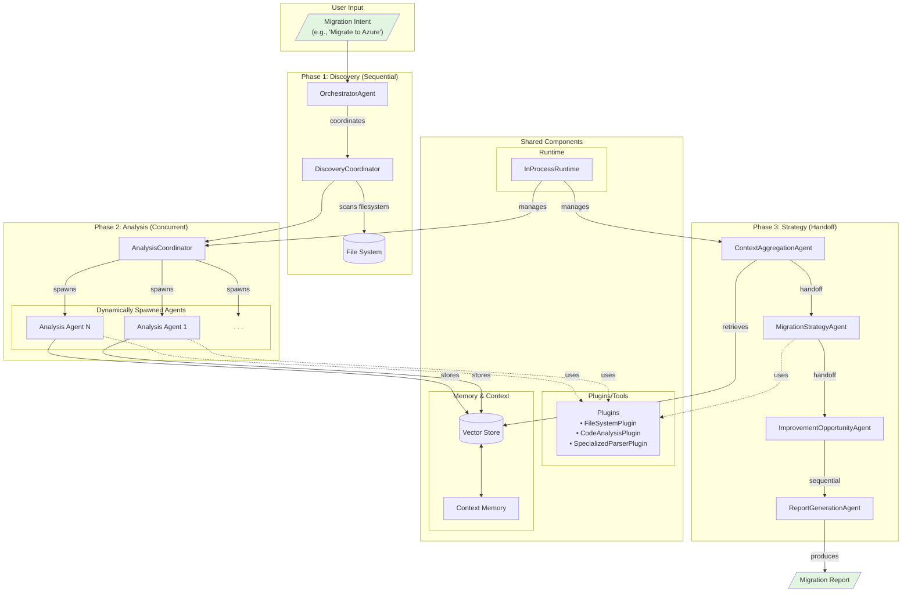
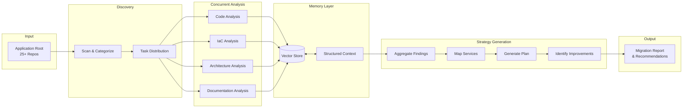

# Cloud Migration Code Researcher - Semantic Kernel Implementation Plan

## Executive Summary

This implementation plan details the architecture and technical approach for building a Cloud Migration Code Researcher system using Microsoft Semantic Kernel (Python). The system will analyze multi-repository applications (25+ repos) and provide comprehensive migration strategies from one cloud provider to another. 

The design emphasizes **simplicity through intelligence** - using a minimal set of powerful plugins (3 plugins, 12 functions total) combined with agent reasoning capabilities to perform complex analysis tasks. This approach reduces development complexity while maintaining analytical power.

## System Architecture Overview



### Data Flow Architecture



## Technology Stack

### Core Framework
- **Semantic Kernel Python** (v1.34.0+)
- **Python 3.10+**
- **Azure OpenAI / OpenAI** for LLM services
- **In-Memory Vector Store** (for PoC, upgradeable to Azure AI Search, Qdrant, etc.)

### Key Dependencies
```
# Core
semantic-kernel==1.34.0
semantic-kernel[azure]  # For Azure OpenAI support
python-dotenv
asyncio
pydantic
typing-extensions

# Parsing Libraries
python-hcl2  # For Terraform file parsing
PyYAML      # For YAML configuration files
lxml        # For XML parsing (pom.xml)
```

## System Architecture

### 1. Agent Hierarchy and Types

> **Important Note**: In the hierarchy below, the sub-items under each agent (e.g., CodeAnalyzer, DependencyAnalyzer) represent **responsibilities and capabilities** of that agent, NOT separate sub-agents. These capabilities are implemented as functions within plugins that the agent uses. This design keeps the agent count manageable while ensuring each agent has all the tools needed for comprehensive analysis.

#### 1.1 Coordinator Agents
```
OrchestratorAgent (Main Controller)
├── DiscoveryCoordinator (responsibility)
├── AnalysisCoordinator (responsibility)
└── StrategyCoordinator (responsibility)
```

#### 1.2 Specialized Analysis Agents (Dynamically Spawned)
```
RepositoryAnalysisAgent (1 per repo)
├── CodeAnalyzer (capability via FileSystemPlugin + CodeAnalysisPlugin)
├── DependencyAnalyzer (capability via SpecializedParserPlugin + agent reasoning)
└── FrameworkDetector (capability via FileSystemPlugin + agent reasoning)

IaCAnalysisAgent (1 total)
├── TerraformAnalyzer (capability via SpecializedParserPlugin)
├── CloudResourceMapper (capability via parsing + agent reasoning)
└── SecurityConfigAnalyzer (capability via FileSystemPlugin + agent reasoning)

ArchitectureDiscoveryAgent (1 total)
├── ServiceMapper (capability via FileSystemPlugin + agent reasoning)
├── IntegrationAnalyzer (capability via code search + agent reasoning)
└── PatternDetector (capability via directory structure analysis + agent reasoning)

DocumentationAgent (1 total)
├── ReadmeParser (capability via FileSystemPlugin - markdown as text)
├── WikiAnalyzer (capability via FileSystemPlugin + agent reasoning)
└── ConfigExtractor (capability via SpecializedParserPlugin)
```

#### 1.3 Strategy and Synthesis Agents
```
MigrationStrategyAgent (1 total)
├── ServiceMapping (capability via agent knowledge of cloud services)
├── ComplexityEstimator (capability via analysis results + agent reasoning)
└── Prioritization (capability via dependency analysis + agent reasoning)

ImprovementOpportunityAgent (1 total)
├── ModernizationAdvisor (capability via pattern analysis + best practices)
├── TechnicalDebtAnalyzer (capability via code analysis results)
└── CloudNativeRecommender (capability via cloud best practices knowledge)
```

### 2. Orchestration Patterns

#### 2.1 Primary Pattern: Hybrid Orchestration
Combines multiple patterns for optimal workflow:

```python
# Phase 1: Discovery (Sequential)
DiscoveryPhase = SequentialOrchestration([
    OrchestratorAgent,
    DiscoveryCoordinator
])

# Phase 2: Analysis (Concurrent + Dynamic)
AnalysisPhase = ConcurrentOrchestration([
    # Dynamically spawned based on discovered repos
    RepositoryAnalysisAgent_1,
    RepositoryAnalysisAgent_2,
    ...,
    RepositoryAnalysisAgent_N,
    IaCAnalysisAgent,
    ArchitectureDiscoveryAgent,
    DocumentationAgent
])

# Phase 3: Strategy (Handoff + Sequential)
StrategyPhase = HandoffOrchestration([
    ContextAggregationAgent,
    MigrationStrategyAgent,
    ImprovementOpportunityAgent
])

# Overall Flow
MigrationOrchestration = SequentialOrchestration([
    DiscoveryPhase,
    AnalysisPhase,
    StrategyPhase,
    ReportGenerationAgent
])
```

#### 2.2 Orchestration Configuration

**Concurrent Orchestration** for parallel repository analysis:
- Max concurrent agents: Configurable (default: 10)
- Timeout per agent: 5 minutes
- Result aggregation: Asynchronous collection

**Handoff Orchestration** for specialized deep dives:
- Dynamic routing based on discovered patterns
- Conditional handoffs for complex scenarios
- Human-in-the-loop capability for critical decisions

**Sequential Orchestration** for phase transitions:
- Ensures proper data flow between phases
- Maintains context continuity
- Validates phase completion before progression

### 3. Plugin Architecture

> **Design Philosophy**: We use a minimal set of plugins that provide essential file access and parsing capabilities. Complex analysis tasks (framework detection, architecture patterns, cloud service usage) are handled through agent reasoning using these basic tools rather than pre-built analysis functions.
>
> **Plugin Summary**:
> - **3 Total Plugins** (down from 6)
> - **12 Total Functions** (down from ~25)
> - **Focus**: File access, language detection, and structured file parsing
> - **Strategy**: Let agents use their reasoning capabilities with simple tools

#### 3.1 Core Plugins

**FileSystemPlugin** (Essential - Used by all agents)
```python
Functions:
- read_file_lines(file_path: str, start_line: int = 1, num_lines: int = 100) -> List[str]
  # Reads specific lines from a file to manage context window
  
- search_text_in_files(pattern: str, file_patterns: List[str], path: str) -> List[SearchResult]
  # Uses grep-like functionality to find patterns across files
  # Returns: [(file_path, line_number, line_content), ...]
  
- find_files_by_pattern(pattern: str, path: str) -> List[str]
  # Finds files matching glob patterns (e.g., "*.py", "**/package.json")
  
- get_file_metadata(file_path: str) -> FileMetadata
  # Returns: size, modified_date, permissions
  
- list_directory_structure(path: str, max_depth: int = 3) -> DirectoryTree
  # Returns hierarchical directory structure
```

**CodeAnalysisPlugin** (Basic language detection and import extraction)
```python
Functions:
- detect_language_by_extension(file_path: str) -> str
  # Simple mapping: {'.py': 'python', '.js': 'javascript', '.tf': 'terraform'}
  
- count_files_by_language(repo_path: str) -> Dict[str, int]
  # Uses find_files_by_pattern() and aggregates by extension
  
- extract_imports(file_path: str, language: str) -> List[str]
  # Regex-based import extraction
  # Python: import X, from X import Y
  # JS: import X from 'Y', require('X')
  # Java: import com.example.X
```

**SpecializedParserPlugin** (For structured configuration files)
```python
Functions:
- parse_terraform_file(file_path: str) -> Dict
  # Uses python-hcl2 library to parse .tf files
  # Returns structured representation of resources, variables, outputs
  
- parse_yaml_config(file_path: str) -> Dict
  # Uses PyYAML for parsing YAML files (docker-compose, k8s manifests)
  
- parse_json_config(file_path: str) -> Dict
  # Standard JSON parsing (package.json, tsconfig.json, etc.)
  
- parse_requirements_file(file_path: str, type: str) -> List[Dependency]
  # Parses dependency files:
  # - Python: requirements.txt, Pipfile, pyproject.toml
  # - Node: package.json dependencies
  # - Java: pom.xml (using xml.etree)
  # Returns: [(name, version, type), ...]
```

#### 3.2 How Agents Use Plugins for Complex Tasks

**Framework Detection Example:**
```
Agent uses FileSystemPlugin to:
1. find_files_by_pattern("package.json|pom.xml|requirements.txt|go.mod", repo_path)
2. For each found file, use read_file_lines() or parse_json_config()
3. Analyze content to identify frameworks (React in package.json, Spring in pom.xml)
```

**Cloud SDK Usage Detection Example:**
```
Agent uses FileSystemPlugin to:
1. search_text_in_files("import.*boto3|from azure|google.cloud", ["*.py"], repo_path)
2. search_text_in_files("@aws-sdk|azure-sdk|@google-cloud", ["*.js"], repo_path)
3. Read relevant code sections to understand usage context
```

**Architecture Pattern Detection Example:**
```
Agent uses FileSystemPlugin to:
1. list_directory_structure() to understand project layout
2. Search for service definitions, API routes, microservice markers
3. Use reasoning to identify monolithic vs microservices vs serverless patterns
```

### 4. Memory and Context Management

#### 4.1 Vector Store Configuration

**Data Model Design**
```python
@vectorstoremodel(collection_name="migration_analysis")
@dataclass
class AnalysisRecord:
    # Key fields
    id: Annotated[str, VectorStoreField('key')]
    
    # Repository information
    repo_name: Annotated[str, VectorStoreField('data', is_indexed=True)]
    repo_type: Annotated[str, VectorStoreField('data', is_indexed=True)]
    
    # Analysis results
    language: Annotated[str, VectorStoreField('data', is_indexed=True)]
    framework: Annotated[str, VectorStoreField('data', is_indexed=True)]
    cloud_services: Annotated[List[str], VectorStoreField('data')]
    dependencies: Annotated[Dict[str, Any], VectorStoreField('data')]
    
    # Content for semantic search
    analysis_summary: Annotated[str, VectorStoreField('data', is_full_text_indexed=True)]
    
    # Vector embedding
    embedding: Annotated[List[float] | None, VectorStoreField(
        'vector',
        dimensions=1536,
        embedding_generator=OpenAITextEmbedding(ai_model_id="text-embedding-3-small")
    )] = None
    
    # Metadata
    timestamp: Annotated[datetime, VectorStoreField('data')]
    agent_name: Annotated[str, VectorStoreField('data')]
```

**Collections Structure**
```python
Collections:
- repository_analysis: Individual repo analysis results
- architecture_insights: Cross-repo architectural patterns
- migration_strategies: Generated migration plans
- improvement_opportunities: Modernization recommendations
- discovered_resources: Cloud resources inventory
```

#### 4.2 Context Memory Structure

**Hierarchical Memory Organization**
```python
GlobalContext = {
    "application_metadata": {
        "total_repos": int,
        "primary_languages": List[str],
        "architecture_pattern": str,
        "cloud_provider": str,
        "target_cloud": str
    },
    "repositories": {
        "repo_name": RepositoryContext
    },
    "architecture": ArchitectureContext,
    "iac_resources": IaCResourceContext,
    "migration_plan": MigrationPlanContext,
    "analysis_metadata": {
        "start_time": datetime,
        "agents_spawned": int,
        "total_files_analyzed": int
    }
}
```

### 5. Agent Implementation Details

#### 5.1 Base Agent Configuration

**Agent Creation Pattern**
```python
class AgentFactory:
    @staticmethod
    async def create_repository_agent(
        repo_path: str,
        kernel: Kernel,
        vector_store: VectorStore
    ) -> ChatCompletionAgent:
        
        # Agent-specific instructions
        instructions = f"""
        You are a specialized repository analysis agent for: {repo_path}
        
        Your responsibilities:
        1. Analyze code structure and patterns using filesystem exploration
        2. Identify frameworks by searching for characteristic files (package.json, pom.xml, etc.)
        3. Extract dependency information from manifest files
        4. Detect cloud service usage by searching for SDK imports and API calls
        5. Assess migration complexity based on your findings
        
        Use the FileSystemPlugin to explore the repository structure and read files.
        Use the CodeAnalysisPlugin to understand languages and imports.
        Use the SpecializedParserPlugin to parse configuration and dependency files.
        Apply your reasoning to identify patterns, frameworks, and architectural decisions.
        Store your findings in the vector store for later retrieval.
        """
        
        # Create agent with minimal but powerful plugins
        agent = ChatCompletionAgent(
            name=f"RepoAnalyzer_{repo_path.replace('/', '_')}",
            instructions=instructions,
            service=AzureChatCompletion(),
            kernel=kernel,
            plugins=[
                FileSystemPlugin(),
                CodeAnalysisPlugin(),
                SpecializedParserPlugin()
            ]
        )
        
        return agent
    
    @staticmethod
    async def create_iac_agent(kernel: Kernel) -> ChatCompletionAgent:
        instructions = """
        You are an Infrastructure as Code analysis specialist.
        
        Your responsibilities:
        1. Find and parse Terraform, CloudFormation, or other IaC files
        2. Extract cloud resource definitions and configurations
        3. Identify networking, security, and compliance settings
        4. Map resource dependencies
        
        Use FileSystemPlugin to find IaC files (*.tf, *.yaml, template.json).
        Use SpecializedParserPlugin to parse Terraform and YAML files.
        Analyze the parsed content to understand infrastructure architecture.
        """
        
        return ChatCompletionAgent(
            name="IaCAnalysisAgent",
            instructions=instructions,
            service=AzureChatCompletion(),
            kernel=kernel,
            plugins=[
                FileSystemPlugin(),
                SpecializedParserPlugin()
            ]
        )
```

#### 5.2 Dynamic Agent Spawning

**Concurrent Repository Analysis**
```python
class AnalysisCoordinator:
    async def spawn_analysis_agents(
        self,
        discovered_repos: List[str],
        kernel: Kernel,
        runtime: InProcessRuntime
    ) -> ConcurrentOrchestration:
        
        agents = []
        
        # Spawn repository agents (one per repo)
        for repo in discovered_repos:
            agent = await AgentFactory.create_repository_agent(
                repo, kernel, self.vector_store
            )
            agents.append(agent)
        
        # Add single instance specialized agents
        agents.extend([
            await AgentFactory.create_iac_agent(kernel),
            await AgentFactory.create_architecture_agent(kernel),
            await AgentFactory.create_documentation_agent(kernel)
        ])
        
        # Create concurrent orchestration
        orchestration = ConcurrentOrchestration(
            members=agents,
            output_transform=self.aggregate_results
        )
        
        return orchestration
    
    async def aggregate_results(self, results: List[Any]) -> AnalysisResult:
        """Aggregate results from all analysis agents"""
        return AnalysisResult(
            repositories=self.extract_repo_analyses(results),
            infrastructure=self.extract_iac_analysis(results),
            architecture=self.extract_architecture_insights(results),
            documentation=self.extract_documentation_summary(results)
        )
```

### 6. Runtime and Execution Management

#### 6.1 Runtime Configuration

**InProcessRuntime Setup**
```python
Runtime Configuration:
- Message timeout: 300 seconds
- Max retries: 3
- Error handling: Graceful degradation
- Logging level: INFO
- Telemetry: Enabled
```

#### 6.2 Execution Flow

```python
class MigrationAnalyzer:
    async def analyze_application(
        self,
        root_path: str,
        target_cloud: CloudProvider
    ) -> MigrationReport:
        
        # Initialize runtime
        runtime = InProcessRuntime()
        runtime.start()
        
        try:
            # Phase 1: Discovery
            discovery_result = await self.discovery_orchestration.invoke(
                task=f"Discover all repositories and documentation in {root_path}",
                runtime=runtime
            )
            
            # Phase 2: Concurrent Analysis
            analysis_result = await self.analysis_orchestration.invoke(
                task="Analyze all discovered components",
                runtime=runtime,
                context=discovery_result
            )
            
            # Phase 3: Strategy Generation
            strategy_result = await self.strategy_orchestration.invoke(
                task=f"Generate migration strategy to {target_cloud}",
                runtime=runtime,
                context=analysis_result
            )
            
            # Generate final report
            report = await self.report_generator.create_report(
                discovery_result,
                analysis_result,
                strategy_result
            )
            
            return report
            
        finally:
            await runtime.stop_when_idle()
```

### 7. Data Flow and Integration

#### 7.1 Inter-Agent Communication

**Message Protocol**
```python
@dataclass
class AgentMessage:
    sender: str
    recipient: str
    message_type: MessageType
    payload: Dict[str, Any]
    timestamp: datetime
    correlation_id: str
```

#### 7.2 Result Aggregation

**Aggregation Strategy**
```python
class ResultAggregator:
    async def aggregate_repository_analyses(
        self,
        results: List[RepositoryAnalysis]
    ) -> ApplicationAnalysis:
        
        # Aggregate language statistics
        language_stats = self.aggregate_languages(results)
        
        # Identify common patterns from agent observations
        patterns = self.detect_common_patterns(results)
        
        # Build dependency graph from parsed dependencies
        dependency_graph = self.build_dependency_graph(results)
        
        # Calculate complexity based on agent assessments
        complexity = self.calculate_overall_complexity(results)
        
        return ApplicationAnalysis(
            language_stats=language_stats,
            patterns=patterns,
            dependencies=dependency_graph,
            complexity=complexity
        )
```

**How Agents Perform Complex Analysis Without Specialized Plugins:**
- **Service Boundary Detection**: Agents analyze folder structure, import patterns, and API definitions
- **Cloud Service Mapping**: Agents use their knowledge of cloud services to map based on SDK usage
- **Architecture Patterns**: Agents infer from directory layout, service communication, and deployment configs
- **Migration Complexity**: Agents assess based on dependencies, cloud service usage, and code patterns

### 8. Error Handling and Resilience

#### 8.1 Agent-Level Error Handling
- Retry logic for transient failures
- Graceful degradation for non-critical agents
- Error context preservation
- Fallback strategies

#### 8.2 Orchestration-Level Resilience
- Timeout management
- Partial result handling
- Circuit breaker pattern for external services
- Recovery checkpoints

### 9. Output and Reporting

#### 9.1 Migration Report Structure
```python
@dataclass
class MigrationReport:
    executive_summary: ExecutiveSummary
    application_overview: ApplicationOverview
    current_architecture: ArchitectureAnalysis
    migration_strategy: MigrationStrategy
    implementation_roadmap: Roadmap
    risk_assessment: RiskAnalysis
    improvement_opportunities: List[Opportunity]
    detailed_findings: DetailedFindings
    appendices: List[Appendix]
```

#### 9.2 Report Generation
- Structured markdown output
- Visual diagrams (mermaid)
- Actionable recommendations
- Priority-based task lists
- Effort estimations

### 10. Performance Optimization

#### 10.1 Concurrency Management
- Batch processing for large repositories
- Agent pool management (limit concurrent file operations)
- Resource-aware spawning
- Progressive result streaming

#### 10.2 Memory Optimization
- Use read_file_lines() to avoid loading entire files
- Incremental vector store updates
- Context pruning strategies
- Selective embedding generation
- Cache parsed configuration files

### 11. Extensibility Points

#### 11.1 Custom Cloud Providers
- Extend agent instructions with knowledge of new cloud services
- Add cloud-specific search patterns to FileSystemPlugin usage
- Enhance SpecializedParserPlugin with new cloud config formats

#### 11.2 Additional Analysis Types
- Security scanning: Add search patterns for vulnerabilities
- Performance analysis: Search for performance anti-patterns
- Cost optimization: Analyze resource definitions for cost implications
- Compliance: Search for compliance-related patterns

#### 11.3 New File Format Support
- Extend SpecializedParserPlugin with new parsers
- Add support for additional dependency management tools
- Support new IaC formats (Pulumi, CDK, etc.)

### 12. Testing Strategy

#### 12.1 Unit Testing
- FileSystemPlugin operations (file reading, searching)
- Parser functions (Terraform, YAML, JSON)
- Language detection and import extraction
- Agent instruction validation
- Memory operation tests
- Orchestration logic tests

#### 12.2 Integration Testing
- Agent + plugin integration
- Multi-agent coordination tests
- Vector store integration tests
- End-to-end workflow tests
- Performance benchmarks

## Implementation Roadmap

### Phase 1: Foundation (Week 1-2)
- Set up Semantic Kernel environment
- Implement base agent classes
- Create three core plugins:
  - FileSystemPlugin (file operations)
  - CodeAnalysisPlugin (language detection, imports)
  - SpecializedParserPlugin (Terraform, YAML, JSON, dependencies)
- Set up vector store
- Test basic agent-plugin interactions

### Phase 2: Analysis Agents (Week 3-4)
- Implement repository analysis agents with framework detection logic
- Create IaC analysis using Terraform parser
- Build pattern detection through agent reasoning
- Implement dependency extraction from package files
- Test concurrent orchestration with multiple repos

### Phase 3: Strategy Generation (Week 5-6)
- Implement cloud service mapping through agent knowledge
- Create strategy synthesis based on analysis results
- Build improvement detection using best practices
- Integrate all phases with handoff orchestration
- Test end-to-end workflow

### Phase 4: Polish and Optimization (Week 7-8)
- Performance optimization
- Error handling improvements
- Report generation enhancement
- Documentation and testing

## Key Considerations

### Simplicity Through Agent Intelligence
- Minimal plugin set (3 plugins, 12 functions) leverages agent reasoning
- Complex analysis emerges from simple tools + LLM capabilities
- Easier to build, test, and maintain
- Reduces development time and complexity

### Scalability
- Design for 25+ repositories from the start
- Implement progressive analysis
- Use streaming for large datasets
- Consider distributed runtime for production

### Flexibility
- Plugin-based architecture for easy extension
- Configurable orchestration patterns
- Swappable LLM providers
- Adaptable to different cloud providers

### Observability
- Comprehensive logging at all levels
- Performance metrics collection
- Agent execution tracing
- Result provenance tracking

This implementation plan provides a comprehensive blueprint for building the Cloud Migration Code Researcher using Semantic Kernel's powerful multi-agent orchestration capabilities.